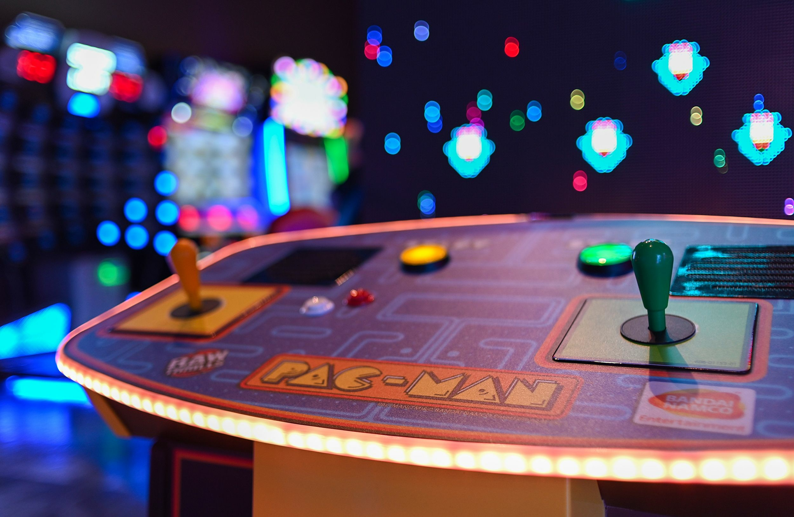

# PacMan 

### Project Title: 
Pac-Man exercise

### Description of Project
This code creates a simple Pac-Man game using JavaScript, HTML, and CSS. The game includes several functions, such as makePac, update, checkCollisions, stopAndFreezeAnimation, and startAnimation.

<ul>
  <li>The makePac function creates a new Pac-Man object with a randomly generated position, velocity, and image.</li>
  <li>The update function is called repeatedly to update the position of each Pac-Man object and check for collisions with the boundaries of the article element.</li>
  <li>The checkCollisions function handles the logic for changing the image and direction of each Pac-Man object when it collides with the article boundaries.</li>
  <li>The stopAndFreezeAnimation and startAnimation functions provide the ability to pause and resume the animation of the Pac-Man objects.</li>
  <li>The HTML code defines the layout of the game using a CSS grid, which includes buttons to add new Pac-Man and Ghost objects, start and pause the animation, and refresh the game.</li>
  <li>The CSS code defines the styles for the game layout and buttons, and includes background images for each button.</li>
  <li>The game is designed with a responsive layout that adapts to different screen sizes, and it includes a dynamic article element that adjusts its dimensions based on the size of the browser window.</li>
</ul>

### How to Run
Fork the repo or clone it to your local machine. 

### Roadmap of future improvements: 
In progress...
-Make the ghosts flicker as in the real game.
-Try to make every added ghost in a different color.
-Make the pacmans change images in order to see them open and close their mouth.

### License information
See licence file
